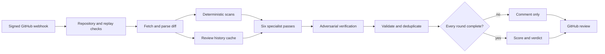

# AI system design

The PR Review Agent is a bounded, event-driven LLM system. It is intentionally
not a conversational agent: each signed webhook starts an isolated review, and
the system publishes an auditable result rather than retaining an open-ended
conversation.

For the companion implementation of durable graph state, memory strategies,
evaluation methodology, and performance benchmarks, see the
[Atlas AI system design case study](https://github.com/mrinmoyece/atlas/blob/main/docs/ai-system-design.md).
General components and deployment topology are canonical in
[Architecture](architecture.md).

## Execution and state lifecycle

`PRReviewAgent` owns the per-review state transition from untrusted event to
published result. Six specialist rounds fan out in parallel, while adversarial
verification runs after their aggregate is available. `ReviewRoundResult`
records the pass, model, status, reviewed chunk count, findings, and incomplete
reason. A failed, truncated, or capped round prevents approval.

Webhook replay state is separate from model state. After HMAC validation,
`RedisWebhookDeliveryStore` atomically reserves an expiring hash of the
authenticated payload, so a substituted unsigned delivery ID cannot bypass
cross-replica replay protection. Redis failure remains fail closed. Team review
patterns are advisory context cached per repository for one hour by
`ReviewHistoryTool`; they are never treated as trusted instructions.

Evidence:

- `src/main/java/com/agentforge/prreview/agent/PRReviewAgent.java`
- `src/main/java/com/agentforge/prreview/model/ReviewRoundResult.java`
- `src/main/java/com/agentforge/prreview/security/RedisWebhookDeliveryStore.java`
- `src/main/java/com/agentforge/prreview/tool/ReviewHistoryTool.java`
- `src/test/java/com/agentforge/prreview/security/RedisWebhookDeliveryStoreTest.java`

## Guardrails and trust boundaries

The system combines deterministic controls with model-output validation:

1. HMAC verification, payload limits, authenticated-payload replay keys,
   delivery metadata, and repository allowlisting constrain the webhook boundary.
2. Static security, architecture, and performance checks provide deterministic
   evidence before model review.
3. Every model request wraps attacker-controlled content in a randomized marker
   and explicitly classifies it as data.
4. Parsed findings must satisfy the output schema, target a changed file, and
   use an added diff line for an inline anchor. Model-provided write eligibility
   and suggested fixes are discarded.
5. Chunk size, chunk count, total-diff, output-token, and finding limits bound
   model work.
6. Fix-candidate reporting is off by default. Trusted application policy can
   identify only verified, anchored, low-severity style findings for Java files
   under `src/main/java` or `src/test/java`; model flags and snippets grant no
   authority, and the agent never writes repository content.
7. Adversarial verification explicitly confirms or rejects every specialist
   finding and independently searches for misses even when specialists found
   nothing; rejected claims cannot affect the verdict. Verification failure
   retains candidates as unverified risk and marks coverage incomplete.
   Candidate decisions are response-batched so valid aggregate volume cannot
   silently exhaust one output-token budget.
8. Incomplete model coverage can produce only `COMMENT`, never `APPROVE`.

Evidence:

- `src/main/java/com/agentforge/prreview/controller/WebhookController.java`
- `src/main/java/com/agentforge/prreview/tool/LLMReviewTool.java`
- `src/main/java/com/agentforge/prreview/tool/GitHubAutoFixTool.java`
- `src/main/resources/prompts/pr-review.md`
- `src/test/java/com/agentforge/prreview/controller/WebhookControllerTest.java`
- `src/test/java/com/agentforge/prreview/tool/GitHubAutoFixToolTest.java`

The complete assets, abuse cases, invariants, privacy assumptions, and residual
risks are canonical in the [Threat model](threat-model.md).

## Observability and performance

Each review emits structured lifecycle logs and exposes Spring Boot actuator and
Micrometer metrics on the separate management port. Review output also contains
per-round status, model, chunk count, detail, and findings, making incomplete
coverage visible to reviewers.

Outer reviews and inner fan-out use separate bounded executors. This avoids the
nested-pool starvation deadlock reproduced by the concurrency regression test.
Static analysis, ticket alignment, history loading, and specialist review are
parallelized; the adversarial pass remains sequential because it depends on the
earlier aggregate. Diff chunking, finding caps, retries, and a one-hour history
cache limit latency and model consumption.

Evidence:

- `src/main/java/com/agentforge/prreview/config/ReviewExecutionConfig.java`
- `src/test/java/com/agentforge/prreview/config/ReviewExecutionConfigTest.java`
- `src/main/resources/application.yml`
- `observability/prometheus.yml`

Operational indicators, initial objective guidance, and runbooks are canonical
in [Operations](operations.md).

## Evaluation approach

The repository evaluates deterministic behavior and safety properties, not
subjective LLM quality. The canonical gates, commands, safety properties, and
future benchmark requirements are in [Evaluation](evaluation.md). Atlas
provides the portfolio's dataset-driven evaluation, memory A/B, and performance
evidence.

## Competency evidence

| Competency | Evidence in this project | Scope |
|---|---|---|
| State management | Explicit review-round state and cross-replica webhook replay state | Strong for event-driven workflows |
| Memory strategy | Repository-scoped, expiring advisory history cache | Limited; no durable conversational memory |
| Evaluation | Deterministic safety tests and CI quality gates | No offline LLM-quality benchmark |
| Guardrails | Layered input, prompt, output, approval, and write controls | Strong |
| Observability | Structured logs, actuator metrics, Prometheus, auditable rounds | No token or cost telemetry |
| Performance | Parallel specialists, isolated bounded pools, chunk and finding budgets, caching | Strong, with concurrency regression coverage |

## Limitations and next evidence

- Review state is not resumable after process termination.
- Model token usage, cost, and per-pass latency are not recorded.
- Team review history is a bounded advisory cache, not a learned memory system.
- There is no curated PR corpus with precision, recall, false-positive, and
  reviewer-agreement thresholds.

These are explicit boundaries rather than hidden claims. Atlas is the portfolio
surface for stateful memory and evaluation; this project specializes in secure,
bounded multi-agent review orchestration.

Priorities for stronger evidence are custom per-round latency/token/cost
telemetry, a versioned labeled PR corpus, resumable review state with idempotent
publication, and calibrated quality thresholds. Each requires an ADR and
evaluation plan before implementation.
