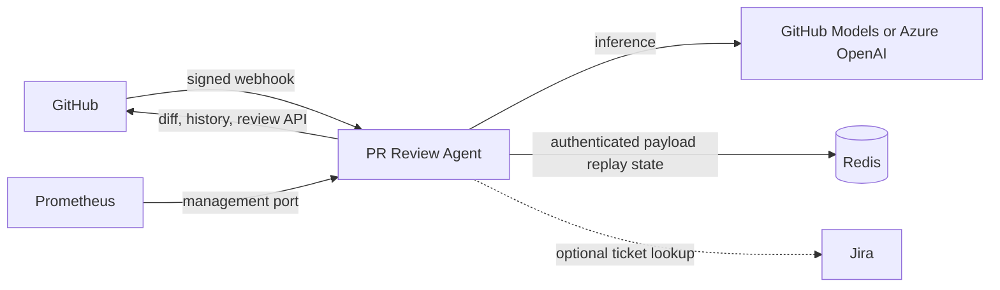
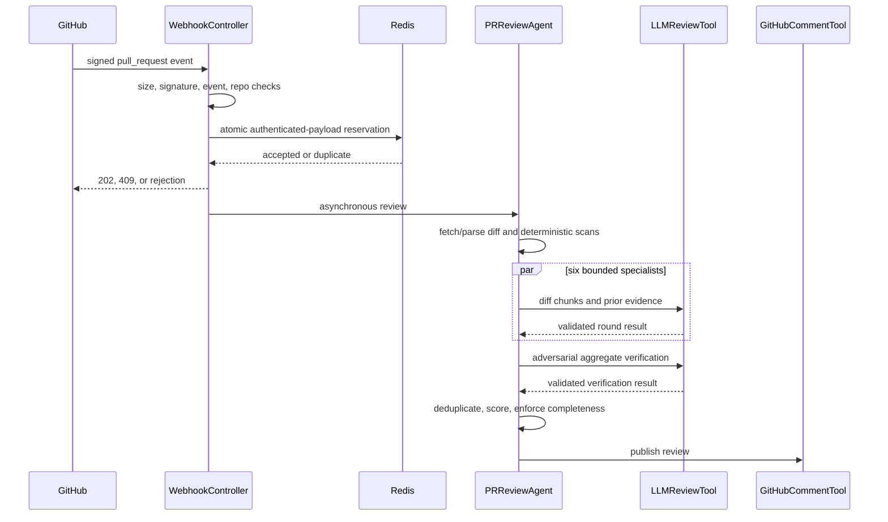

# Architecture

## Scope

The service accepts authenticated GitHub pull-request events, retrieves the
changed diff, combines deterministic analysis with bounded LLM specialists, and
posts an auditable GitHub review. It does not execute repository code or retain
an open-ended conversation.

LLM-specific design and competency evidence are canonical in
[AI system design](ai-system-design.md). Security assumptions and abuse cases
are canonical in the [threat model](threat-model.md).

## System context

| Boundary | Authentication | Data handled |
|---|---|---|
| GitHub webhook | `X-Hub-Signature-256` HMAC | Repository identity, PR metadata |
| GitHub API | Least-privilege GitHub App token preferred | Diff, history, review output |
| Model API | Separate inference credential | Bounded diff chunks and advisory context |
| Redis | Network policy and optional password/TLS provided by deployment | Authenticated payload hashes with expiry |
| Jira | Optional account and token | Ticket text and alignment result |
| Management port | Internal network boundary | Health and metrics |

## Review control flow

The webhook acknowledges accepted work before review completion. Authenticated
payload hashes are deduplicated in Redis while work is active and after success,
so changing an unsigned delivery ID cannot bypass replay protection. A failed
asynchronous review releases its reservation so GitHub can retry it; failure is
never converted into an approval.

## Components

| Component | Responsibility |
|---|---|
| `WebhookController` | External request validation and trigger policy |
| `PRReviewAgent` | Review lifecycle and verdict orchestration |
| `GitHubDiffTool` | Diff retrieval and changed-line parsing |
| Deterministic scan tools | Security, architecture, and performance evidence |
| `ReviewHistoryTool` | Bounded repository-specific advisory context |
| `LLMReviewTool` | Specialist calls, chunking, validation, and retries |
| `GitHubAutoFixTool` | Opt-in write path limited to trusted deterministic eligibility and Java source roots |
| `GitHubCommentTool` | Review and coverage publication |
| `RedisWebhookDeliveryStore` | Cross-replica replay protection |

## State and consistency

- Review state lives in the asynchronous request lifecycle and is not resumable.
- Every `ReviewRoundResult` records completeness and coverage metadata.
- Authenticated payload replay keys are shared across replicas and expire after
  the configured retention period; delivery IDs remain sanitized log metadata.
- Team patterns are cached in-process for one hour; they are advisory and may be
  recomputed after restart.
- GitHub remains the source of truth for diffs, branches, and published reviews.

## Verdict semantics

Verdicts are severity- and completeness-driven:

- any critical or high finding produces `REQUEST_CHANGES`;
- incomplete coverage produces `COMMENT`, even with no blocking finding;
- medium or low findings produce `COMMENT`;
- only complete coverage without findings produces `APPROVE`.

The 0-100 score is a severity-weighted summary displayed with the review. It
does not determine or override the verdict.

## Concurrency and failure isolation

Outer reviews use `reviewExecutor`; inner static and specialist work uses
`reviewFanOutExecutor`. Separate bounded pools avoid nested-pool starvation.
Adversarial verification remains sequential because it consumes the specialist
aggregate. Model calls have retry limits, diff and finding budgets, and explicit
incomplete states. Chunk-count limits bound request fan-out, and continuation
chunks carry adjusted hunk coordinates. If verification cannot inspect complete
evidence, candidates remain visible while the round fails closed.

See [ADR-0002](adr/0002-separate-review-executors.md) and
[Operations](operations.md).

## Deployment topology

Production manifests run two non-root replicas with read-only filesystems,
resource limits, health probes, a disruption budget, and a network policy.
Redis must be shared by all replicas. Port 8080 serves webhooks; port 9090 is
management-only. Images are published by immutable commit tag with SBOM and
provenance.

Deployment requirements and rollback are in
[Enterprise deployment](enterprise-deployment.md).
