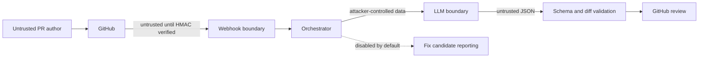

# Threat model

## Scope and assets

This model covers webhook ingestion, GitHub and Jira reads, model inference,
review publication, optional auto-fix, replay state, logs, and metrics.

Protected assets:

- GitHub App and model credentials;
- repository source and pull-request metadata;
- webhook authenticity and delivery state;
- review integrity, completeness, and attribution;
- optional Jira content;
- review publication access; repository-content writes are prohibited.

## Actors and trust boundaries

| Actor | Assumption |
|---|---|
| Pull-request author | Untrusted; controls diff, title, body, filenames, and comments |
| Webhook sender | Untrusted until HMAC, event, repository, and delivery checks pass |
| Model | Probabilistic and untrusted; output is data requiring validation |
| GitHub/Jira API | Authenticated dependency that can fail, throttle, or return malformed data |
| Operator | Trusted to configure secrets, identities, allowlists, and network policy |
| Dependency/action publisher | Supply-chain actor constrained by checksums, SHA pins, and scans |

## Abuse cases and controls

| Threat | Primary controls | Residual risk |
|---|---|---|
| Forged webhook | HMAC verification, constant-time comparison, payload cap | Secret compromise permits forgery until rotation |
| Replay or duplicate delivery | HMAC validation followed by an expiring Redis reservation keyed by authenticated payload hash; failed-work release | Redis loss can reject legitimate events because processing fails closed |
| Cross-repository abuse | Explicit repository allowlist | Misconfigured allowlist broadens scope |
| Prompt injection | Random trust markers, system instructions, no model tool execution | A model can still produce plausible but incorrect findings |
| Malformed or fabricated findings | JSON parsing, changed-file validation, added-line anchoring, length and count caps | General findings without a line still require human judgment |
| Incomplete review presented as approval | Per-round status, hunkless/binary-change detection, adversarial empty-result review, completeness gate | GitHub policy must require the review/check expected by the organization |
| Unauthorized writes | No repository-content write implementation, model write flags discarded, trusted low-style candidate policy, Java source allowlist, least-privilege token | A future write feature would require a new threat review and human approval boundary |
| Secret leakage through logs/prompts | Separate credentials, bounded data, log sanitization, secret scanning | Source diffs are sent to the configured model provider |
| Resource exhaustion | Request cap, diff/chunk/finding/token budgets, bounded executors | Many allowed repositories can still create sustained load |
| Supply-chain compromise | Action SHA enforcement/allowlist, Gradle checksums, CodeQL, Gitleaks, Trivy, SBOM | A trusted pinned artifact may later be discovered vulnerable |
| Management endpoint exposure | Separate port and deployment network boundary | Kubernetes policy must be narrowed to the actual monitoring namespace |

## Security invariants

1. Unauthenticated or disallowed requests never start reviews.
2. Model output never grants authorization or expands write scope.
3. Failed, capped, or truncated model coverage never approves.
4. The agent never writes repository content; optional candidate reporting never
   targets protected paths.
5. Redis failure rejects webhook processing rather than bypassing replay checks.
6. Production identities use only the permissions required by enabled features.

## Privacy and data handling

Repository diffs, review history, and optional ticket text leave the service for
the configured model endpoint. Deployers must choose a provider, region,
retention policy, and contract appropriate for source-code classification.
Provider selection is explicit and fails startup when that provider's endpoint
or credential is missing; configuration never falls through to another provider.
Avoid production payloads in tests. Logs must not contain credentials or raw
authorization headers. Delivery identifiers expire; review results persist in
GitHub according to repository retention.

## Validation and ownership

Boundary tests live in `WebhookControllerTest`, `GitHubAutoFixToolTest`, and
`RedisWebhookDeliveryStoreTest`. CI supply-chain controls live under
`.github/workflows/`. Vulnerabilities follow [SECURITY.md](../SECURITY.md).
Operators follow [Operations](operations.md) for containment and credential
rotation.
